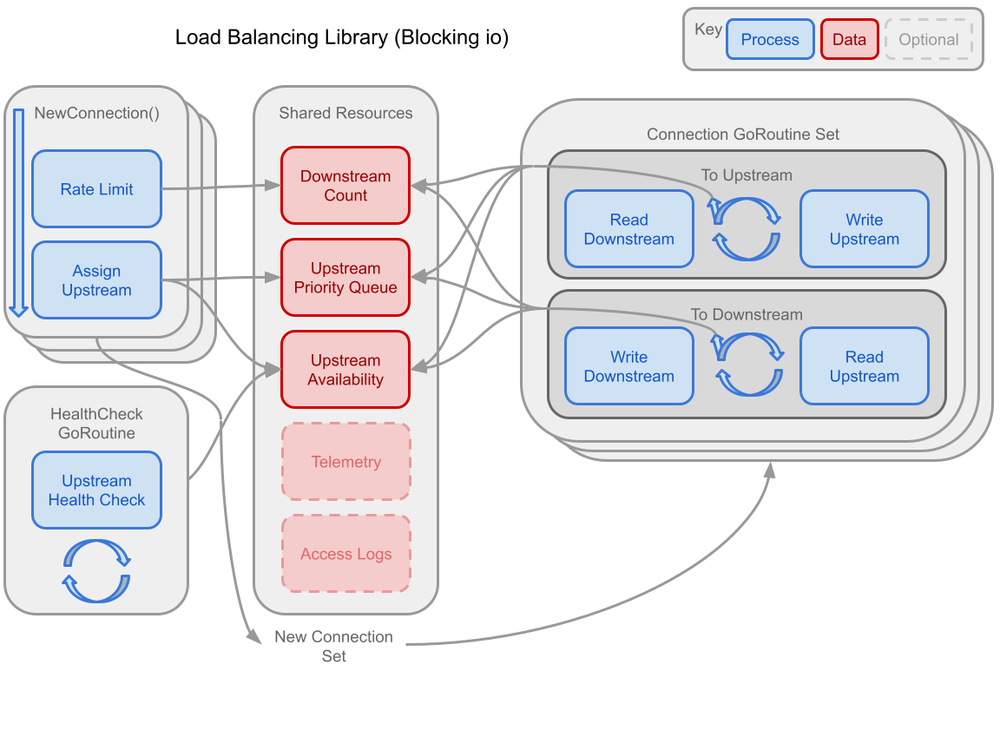
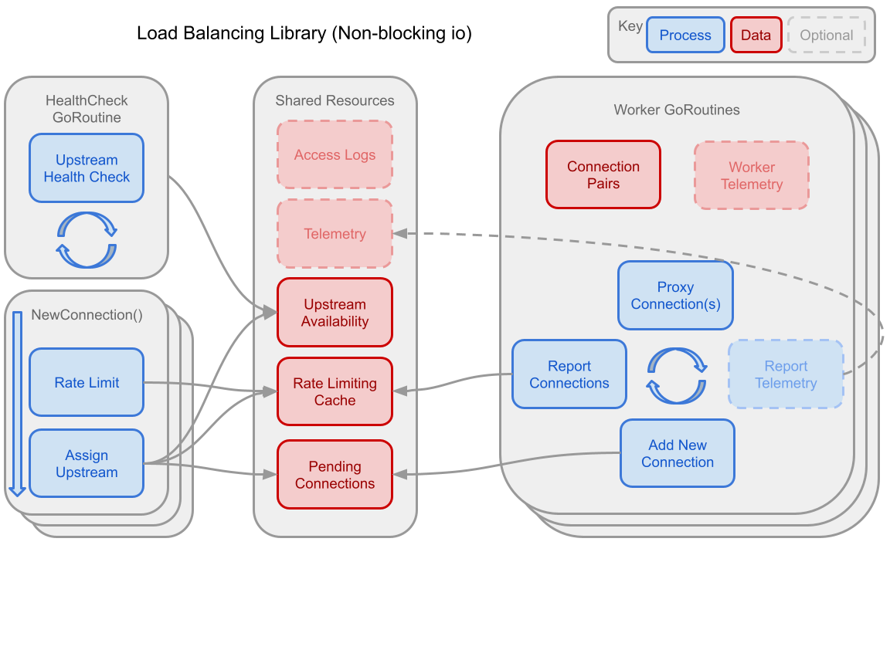
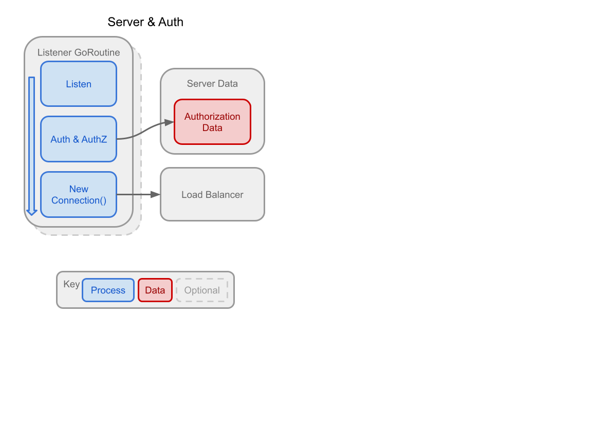

# **RFD 0000 - TCP Load Balancer**

# Required Approvers
2 of 3 (@jakule, @smallinsky, @rosstimothy)


# What
A Layer 4 load balancer library with rate limiting and health checking. Server leveraging library behind mTLS.

# Why
Describe the features and design of a layer 4 load balancer as a catalyst for discussion and guide for work. Generally depict my skills as an engineer by simulating working with a small team from teleport engineering.

# Details

## Scope
### Library
- Least connections connection forwarder – upstream connection tracking
- Per-client connection rate limiter – downstream connection tracking
- Health checking – only healthy upstreams should receive new connections
### Server
- Accept and forward connections to upstreams using the library
- Simple authorization scheme – what upstreams are available to which clients
- mTLS authentication – mutual identity authentication

## Security Considerations
Downstream clients should be considered untrustworthy until authenticated, no operation should proceed authentication.

Overloading Upstream systems should be prevented through rate limiting downstream clients. Downstream clients will receive errors when they are being rate limited. These errors and others shouldn't expose internal information about upstream hosts, inaccessible host groups, or other downstream clients. In general, errors should give ample information to a downstream client, but nothing more than necessary for them to address the issue.

### Remaining Risks (not exhaustive)
- Self signed certs are generally less secure and more easily imitated
- Sum of possible downstream client connections still is more load than upstream can handle.
- Unauthenticated downstreams overwhelm load balancer with requests to authenticate.
- Mistakes in implementation could offer a means to create zombie connections or goroutine leaks, eventually crashing the load balancer.

For further details see [Authentication & mTLS](###Authentication-&-mTLS)

## Implementation - Library
### Rate Limiting
Rate Limiting is performed for both downstreams and upstreams. It will leverage a sliding window algorithm to count requests and deny requests that exceed the limits. A KV-store supporting TTL will hold the request counts. Ideally it would also support LFU eviction (protecting the LB from OOM) and concurrent access (preventing bottle-necking/contention on the shared KV-store). 

### Upstreams
Health checking is both passive and active. Upstreams are treated as available only after succeeding a routine (+ jitter) health check. Upstreams become unavailable after either failing a health check, timing out, or returning a connection error. A connection will choose the upstream that has the least existing connections based on the sliding windows supported by the rate limiting. 

### API

```go
type LoadBalancer
    func Start(ctx context.Context) error
    func Stop(ctx context.Context) error
    func ForceStop()

    func SetRateLimit(client string, connections int, window time.Time) error
    func AddUpstream(upstreamGroup string, Config Upstream) error
    func RemoveUpstream(upstreamGroup string, Config Upstream) error
    func Handle(downstreamID string, upstreamGroup string, conn net.TCPConn)
```


### Option 1 - Blocking IO (Recommended)
Leverage goroutines to build a “concurrent-first” design.

Pros
- Typical solution for golang, leverage goroutines, follows language paradigms

Cons
- Requires more concurrent code, channels / contexts
- Maybe bug prone with pitfalls for deadlock, go routine leaks, and general concurrency bugs
- Consume great deals of memory. 4k ram per routine. At least 2 routines per connection. ~1Mil connections = 8 Gb for goroutines alone




### Option 2 - Non-Blocking IO (**Not** Recommended)
Leverage net.TCPConn’s implementation of net.Conn deadlines. Set to times far enough in advance to guarantee pending data is returned, but soon enough that a read call appears to be non-blocking.

Pros
- Typical solution for leading Load Balancing solutions
- Avoids context switching (not critical because goroutines switch easily)

Cons
- Requires fiddling with net.TCPConn ReadDeadline lengths
- Maybe brittle - deadlines would have to be based on benchmarks for reading bytes from syscalls vs having nothing to read from the socket. Machine variance sounds painful to address




## Implementation - Server

### CLI UX
A strait forward CLI will be offered, and will start the server based on hard coded configurations. The process will listen for signals and stop accordingly. 

### Authentication & mTLS
The server will support TLS 1.3 (2018), which dropped support for older, less secure cryptographic features and it sped up TLS handshakes, among other improvements. The server will support at least one of the recommended suites; cipher suites supported by TLS 1.3:
- TLS_AES_128_GCM_SHA256 (0x13, 0x01)     >recommended<
- TLS_AES_256_GCM_SHA384 (0x13, 0x02)     >recommended<
- TLS_AES_128_CCM_SHA256 (0x13, 0x04)
- TLS_AES_128_CCM_8_SHA256 (0x13, 0x05)
- TLS_CHACHA20_POLY1305_SHA256            >recommended<

Certificates should typically be signed by a certificate authority, for the purposes of this challenge, they will be self-signed. This is generally considered less secure.

### Authorization
The server will authorize new connections based on a simple scheme defining server groups and clients which are allowed to access them. It will be whitelist only. 



## Additional considerations (optional)

### Upstream Connection Pools
Generally a good feature for any system which consistently holds many connections to another service/system. Pools could be dynamically sized to prevent resource overuse. Pools can also be created per worker to entirely avoid contention.

### Service Discovery
A common integration for load balancers, gateways, and proxy servers. Service discovery automates adopting and forgetting upstream hosts. This enables auto scaling and cooperates nicely with ephemeral services and systems.
